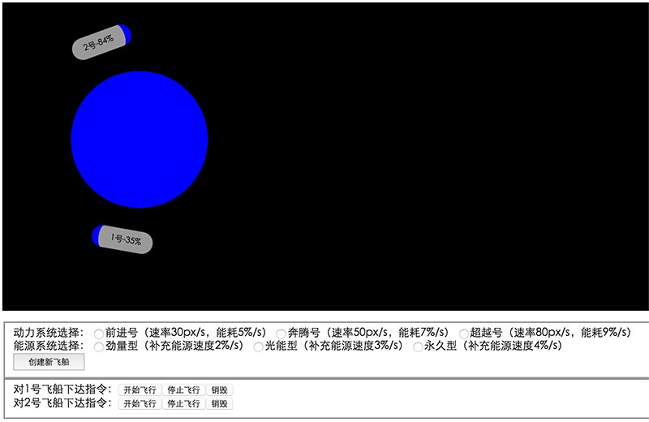

# 任务二十七：行星与飞船（二）
* 面向人群：
有一定JavaScript基础，希望学习或加强面向对象编程及设计模式相关知识的同学
* 难度：
中等

## 重要说明
* 百度前端技术学院的课程任务是由百度前端工程师专为对前端不同掌握程度的同学设计。我们尽力保证课程内容的质量以及学习难度的合理性，但即使如此，真正决定课程效果的，还是你的每一次思考和实践。
* 课程多数题目的解决方案都不是唯一的，这和我们在实际工作中的情况也是一致的。因此，我们的要求不仅仅是实现设计稿的效果，更是要多去思考不同的解决方案，评估不同方案的优劣，然后使用在该场景下最优雅的方式去实现。那些最终没有被我们采纳的方案，同样也可以帮助我们学到很多知识。所以，我们列出的参考资料未必是实现需求所必须的。有的时候，实现题目的要求很简单，甚至参考资料里就有，但是背后的思考和亲手去实践却是任务最关键的一部分。在学习这些资料时，要多思考，多提问，多质疑。相信通过和小伙伴们的交流，能让你的学习事半功倍。

## 任务目的
* 练习JavaScript面向对象设计
* 实践一些基础的设计模式

## 任务描述
* 基于任务二十六，我们继续改善我们的任务
* 第一代宇宙飞船系统真是糟糕的实现，所以我们需要进行改进飞船自身，我们在几个部件进行了更多的组合可能性，在创建新飞船时可以自行选择，如图
* 我们新增了几种动力系统，能够让飞船飞得更快，相应的能源消耗也会不同
* 我们新增了集中能源系统，能够让飞船能量补充能源速度越快
* 接下来改进的是指令的传播问题
* 我们发明了新一代的传播介质BUS，它的单次传播失败率降低到10%，传播速度提升到300ms，而且他增加了多次重试的功能，可以保证信息一定能够传递出去，请你实现这个可以通过多次重试保证在10%丢包率情况下顺利将信息传递出去的BUS传播介质
* 但BUS有个弱点，就是无法直接传递JSON格式，它只能传递二进制码，但指挥官并不能够直接下达二进制编码指令，所以我们需要在行星上的发射器部分增加一个模块Adapter，把原来的指令格式翻译成二进制码。同时还需要在飞船的接收器部分增加一个Adapter，用来把二进制码翻译成原来能够理解的指令格式
* 二进制码格式自定，可以参考的例子：前四位标示飞船编号，后四位标示具体指令（0001：开始飞行，0010：停止飞行，1100：自我销毁）

## 任务注意事项
* 实现功能的同时，请仔细学习JavaScript相关的知识
* 相关信息发送、接受等，建议在控制台中输出
* 任务说明中的各种数值说明只是参考，可能存在不合理性，可以自行设定
* 实现各种功能、模块时，不需要生搬硬套设计模式，但希望你就设计模式相关知识进行学习，并进行合理的借鉴运用
* 请注意代码风格的整齐、优雅
* 代码中含有必要的注释
* 允许使用jQuery等库，但不建议使用React、Angular等框架

## 任务协作建议
* 如果是各自工作，可以按以下方式：
* 团队集中讨论，明确题目要求，保证队伍各自对题目要求认知一致
* 各自完成任务实践
* 交叉互相Review其他人的代码，建议每个人至少看一个同组队友的代码
* 相互讨论，最后合成一份组内最佳代码进行提交
* 如果是分工工作（推荐），可以按以下模块切分
* 飞船类
* Adapter
* BUS

## 在线学习参考资料
* [JavaScript Design Patterns](http://www.dofactory.com/javascript/design-patterns)
* [4 JavaScript Design Patterns You Should Know](https://scotch.io/bar-talk/4-javascript-design-patterns-you-should-know)
* [JavaScript Design Patterns](https://carldanley.com/javascript-design-patterns/)
* [Understanding Design Patterns in JavaScript](http://code.tutsplus.com/tutorials/understanding-design-patterns-in-javascript--net-25930)
* [在线电子书：Learning JavaScript Design Patterns](https://addyosmani.com/resources/essentialjsdesignpatterns/book/)
* [JavaScript 设计模式 – 第一部分： 单例模式、组合模式和外观模式](http://www.adobe.com/cn/devnet/html5/articles/javascript-design-patterns-pt1-singleton-composite-facade.html)
* [JavaScript 设计模式 – 第二部分： 适配器、装饰者和工厂模式](http://www.adobe.com/cn/devnet/html5/articles/javascript-design-patterns-pt2-adapter-decorator-factory.html)
* [JavaScript设计模式一：工厂模式和构造器模式](https://segmentfault.com/a/1190000002525792)
* [JavaScript 设计模式读书笔记(五)——工厂模式](https://segmentfault.com/a/1190000000491074)
* [Alloy JavaScript 设计模式](http://www.alloyteam.com/2012/10/common-javascript-design-patterns/)
* [常用的Javascript设计模式](http://blog.jobbole.com/29454/)
* [javascript常见的设计模式举例](http://blog.csdn.net/yingyiledi/article/details/26725795)
* [前端攻略：javascript 设计模式](http://www.cnblogs.com/Darren_code/archive/2011/08/31/JavascripDesignPatterns.html)
