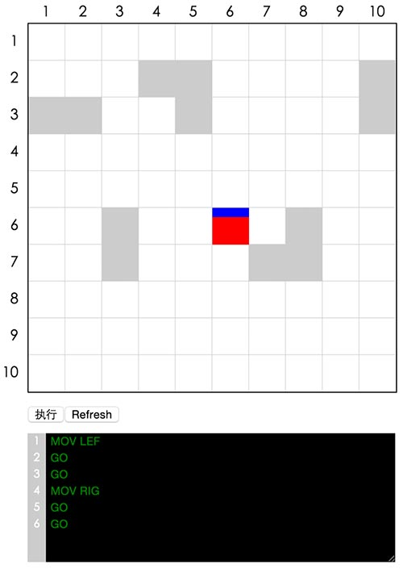

# 任务三十六：听指令的小方块（四）
* 面向人群：
有一定JavaScript基础
* 难度：
高

## 重要说明
* 百度前端技术学院的课程任务是由百度前端工程师专为对前端不同掌握程度的同学设计。我们尽力保证课程内容的质量以及学习难度的合理性，但即使如此，真正决定课程效果的，还是你的每一次思考和实践。
* 课程多数题目的解决方案都不是唯一的，这和我们在实际工作中的情况也是一致的。因此，我们的要求不仅仅是实现设计稿的效果，更是要多去思考不同的解决方案，评估不同方案的优劣，然后使用在该场景下最优雅的方式去实现。那些最终没有被我们采纳的方案，同样也可以帮助我们学到很多知识。所以，我们列出的参考资料未必是实现需求所必须的。有的时候，实现题目的要求很简单，甚至参考资料里就有，但是背后的思考和亲手去实践却是任务最关键的一部分。在学习这些资料时，要多思考，多提问，多质疑。相信通过和小伙伴们的交流，能让你的学习事半功倍。

## 任务目的
* 练习JavaScript在DOM、字符串处理相关知识
* 利用JavaScript实践寻路相关算法

## 任务描述
* 如图，新增元素“墙”，墙是正方形不可进入、越过的区域
* 新增修墙的指令，BUILD，执行指令时，会在当前方块面对的方向前修建一格墙壁，如果被指定修墙的地方超过边界墙或者已经有墙了，则取消修墙操作，并调用浏览器的console.log方法打印一个错误日志
* 新增粉刷的指令，BRU color，color是一个字符串，保持和css中颜色编码一致。执行指令时，如果当前方块蓝色边面对方向有紧相邻的墙，则将这个墙颜色改为参数颜色，如果没有，则通过调用浏览器的console.log方法，打印一个错误日志
* 尝试写一段代码，实现在空间内修建一个长长的五颜六色的墙或者有趣的图形
* 新增一个按钮，可以在空间内随机生成一些墙
* 增加一个指令：MOV TO x, y，会使得方块从当前位置移动到坐标为x，y的地方，移动过程中不能进入墙所在的地方，寻路算法请自行选择并实现，不做具体要求

## 任务注意事项
* 实现功能的同时，请仔细学习JavaScript相关的知识
* 请注意代码风格的整齐、优雅
* 代码中含有必要的注释
* 建议不使用任何第三方库、框架
* 寻路算法可以参考已有代码，但不建议直接引用现成的算法文件，最起码自己敲一遍
* 有余力的同学，可以实现多种寻路算法，并在MOV TO指令中增加算法的选择功能，比如MOV TO x,y BY xxx（算法标示）

## 任务协作建议
* 如果是各自工作，可以按以下方式：
* 团队集中讨论，明确题目要求，保证队伍各自对题目要求认知一致
* 各自完成任务实践
* 交叉互相Review其他人的代码，建议每个人至少看一个同组队友的代码
* 相互讨论，最后合成一份组内最佳代码进行提交
* 如果是分工工作（推荐），可以按以下模块切分
* 墙相关的功能
* 碰撞检测
* 新指令的解析
* 各种寻路算法，可以每人实现一个

## 在线学习参考资料
* [JavaScript入门篇](http://www.imooc.com/view/36)
* [MDN JavaScript](https://developer.mozilla.org/zh-CN/docs/Web/JavaScript)
* [各种寻路算法的可视化呈现](http://qiao.github.io/PathFinding.js/visual/)
