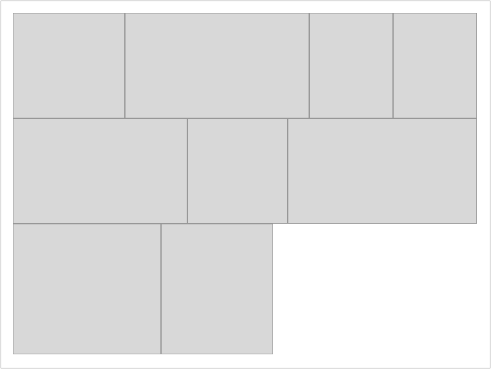

# 任务四十五：多功能相册之木桶布局
* 面向人群：
有一定HTML、CSS、JavaScript基础
* 难度：
困难

## 重要说明
* 百度前端技术学院的课程任务是由百度前端工程师专为对前端不同掌握程度的同学设计。我们尽力保证课程内容的质量以及学习难度的合理性，但即使如此，真正决定课程效果的，还是你的每一次思考和实践。
* 课程多数题目的解决方案都不是唯一的，这和我们在实际工作中的情况也是一致的。因此，我们的要求不仅仅是实现设计稿的效果，更是要多去思考不同的解决方案，评估不同方案的优劣，然后使用在该场景下最优雅的方式去实现。那些最终没有被我们采纳的方案，同样也可以帮助我们学到很多知识。所以，我们列出的参考资料未必是实现需求所必须的。有的时候，实现题目的要求很简单，甚至参考资料里就有，但是背后的思考和亲手去实践却是任务最关键的一部分。在学习这些资料时，要多思考，多提问，多质疑。相信通过和小伙伴们的交流，能让你的学习事半功倍。

## 任务目的
* 练习综合运用HTML、CSS、JavaScript实现局部功能
* 为第四阶段的相册任务做准备
* 结合CSS，JavaScript掌握木桶布局方式

## 任务描述
* 参考如下设计图，使用JavaScript、CSS，实现如图的木桶布局。我们在一些摄影网站（如 500px、flickr 等）有时会看到如下图的布局，每张图片的占位长宽比和图片本身的长宽比是一致的；每一行的高度是不固定的，但是要尽可能接近；每行的图片数也是不同的，在一定范围内（这题中我们规定每行 3-6 张，最后一行除外）通过控制图片是否加入当前行，保证行高尽可能接近。这里我们方便起见给这种布局起名叫“木桶布局”，因为它和木桶一样，不在乎你放多少块木头，以及不同圈的木头高度是否一致，只要每圈都把桶围成同样宽度。
* 
* 实现封装为一个JavaScript的库

## 任务注意事项
* 请注意代码风格的整齐、优雅
* 代码中含有必要的注释
* 可以合理选择使用其它第三方类库，但不建议。不能直接使用木桶布局的库

## 任务协作建议
* 团队集中讨论，明确题目要求，保证队伍各自对题目要求认知一致
* 各自完成任务实践
* 交叉互相Review其他人的代码，建议每个人至少看一个同组队友的代码
* 相互讨论，最后合成一份组内最佳代码进行提交

## 在线学习参考资料
* [CSS clip-path maker](http://bennettfeely.com/clippy/)
* [PLACEHOLD.IT 用来占位的不同大小的图片生成工具](https://placehold.it/)
